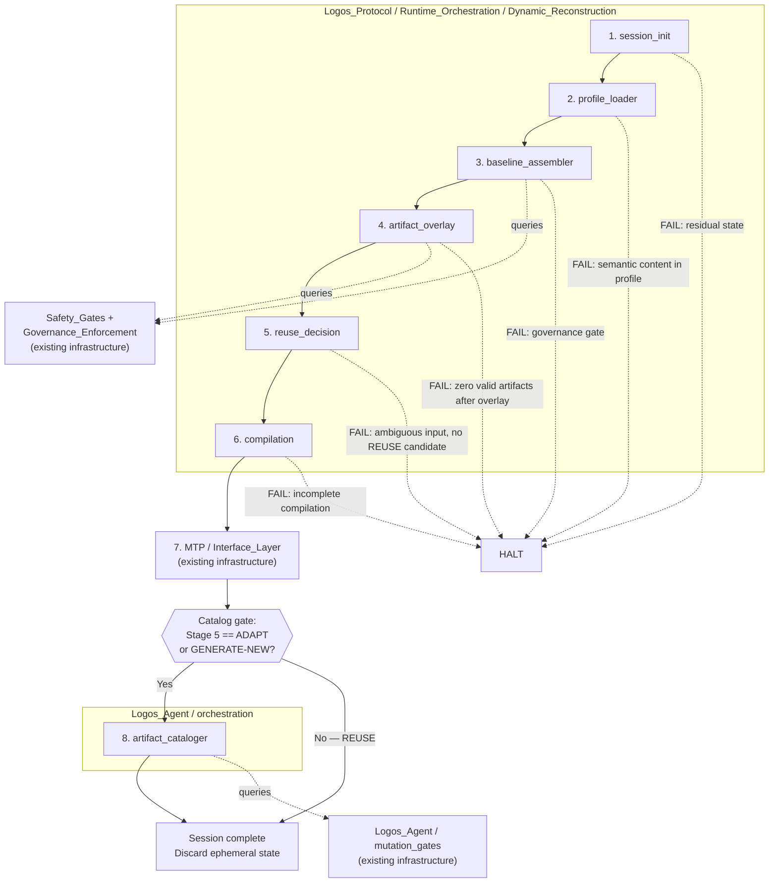

# Reconstruction Scaffolding — Module Structure & Pipeline Flow
**LOGOS | Phase 2: Prototype | Design-Only | No Executable Content**

---

## 1. Placement Rationale

The 8 pipeline stages from the DR/AC Specification split across two authority domains, driven by the runtime authority graph.

**Stages 1–6 → `Logos_Protocol/Runtime_Orchestration/`**
These stages select, validate, and compose. They hold no write authority and interpret no meaning. `Runtime_Orchestration` is the canonical location for session-surface assembly logic. A new sub-directory `Dynamic_Reconstruction/` is proposed within it.

**Stage 7 → No new module.**
Output delivery is owned by existing infrastructure at `Meaning_Translation_Protocol/Interface_Layer/`. The scaffolding hands off a completed compilation; it does not duplicate the delivery path.

**Stage 8 → `Logos_Agent/orchestration/`**
Cataloging is the sole persistence gate in the pipeline. Write authority is required. Only `Logos_Agent` holds it. The cataloger is placed under its existing `orchestration/` sub-path and is gated by `mutation_gates` before any write executes.

---

## 2. Module Table

| Stage | Module | Target Path | Layer | Responsibility |
|-------|--------|-------------|-------|----------------|
| 1 | `session_init` | `Logos_Protocol/Runtime_Orchestration/Dynamic_Reconstruction/` | Orchestration | Establish clean session state. Detect and reject residual. |
| 2 | `profile_loader` | ↑ (same directory) | Orchestration | Load user Recall Objects and Calibration Signal aggregates. Reject any semantic content in profile. |
| 3 | `baseline_assembler` | ↑ | Orchestration | Load Canonical Primitives unmodified. Query governance gates. Produce validated baseline. |
| 4 | `artifact_overlay` | ↑ | Orchestration | Retrieve Curated Artifacts via Recall Objects. Validate each against current governance. Extend baseline additively. |
| 5 | `reuse_decision` | ↑ | Orchestration | Classify current input. Query Recall index across three dimensions (input class, constraint set, effectiveness). Return: REUSE, ADAPT, or GENERATE-NEW. **Invariant:** Recall index queries are read-only; no scoring or ranking mutation is permitted. |
| 6 | `compilation` | ↑ | Orchestration | Assemble Session-Ephemeral Compilation from baseline + overlay + Stage 5 outcome. **Invariant:** must not introduce semantic content not present in baseline or validated artifacts. |
| 7 | *(existing)* | `Meaning_Translation_Protocol/Interface_Layer/` | *(existing)* | Output delivery. Not owned by this scaffolding. |
| 8 | `artifact_cataloger` | `Logos_Agent/orchestration/` | Orchestration | Persist new or adapted artifacts. Attach metadata. Create or update Recall Objects. Discard session-ephemeral state. Gated by `mutation_gates`. |

---

## 3. Pipeline Flow



---

## 4. Governance Enforcement Points

The scaffolding does **not** implement governance enforcement. It queries existing enforcement infrastructure and responds to results. This preserves the canonical enforcement topology defined in `GOVERNANCE_ENFORCEMENT_INDEX`.

| Module | Queries | Governance Artifacts Checked | On FAIL |
|--------|---------|------------------------------|---------|
| `baseline_assembler` | `Logos_Protocol/Safety_Gates` | Phase_Definitions, Denial_Invariants, Design_Only_Declarations | HALT — no continuation |
| `artifact_overlay` | `Logos_Protocol/Safety_Gates` | Denial_Invariants, Design_Only_Declarations (per artifact) | Skip artifact. If zero artifacts remain valid after overlay, HALT. |
| `artifact_cataloger` | `Logos_Agent/mutation_gates` | Autonomy_Policies | Reject cataloging for this artifact. Session is unaffected; ephemeral state still discarded. |

Three properties hold at every enforcement point: the scaffolding receives a binary validation result, it does not inspect or interpret the governance artifact directly, and it does not provide a fallback that circumvents a FAIL.

---

## 5. Fail-Closed Transitions

Every transition between stages defines a precondition. Failure of that precondition triggers HALT — no fallback, no degraded continuation, no escalation.

| Transition | Precondition | Failure Condition | Action |
|------------|--------------|-------------------|--------|
| 1 → 2 | Session state is clean | Residual state detected | HALT |
| 2 → 3 | Profile contains only non-semantic data | Semantic content detected in profile | HALT |
| 3 → 4 | Baseline is governance-validated | Any governance gate returns FAIL | HALT |
| 4 → 5 | If Curated Artifacts were available for overlay, at least one survives validation. An empty candidate set is valid and proceeds with baseline-only compilation. | Curated Artifacts were available and all failed validation | HALT |
| 5 → 6 | Input is classified and a decision is resolved | Input classification ambiguous AND no REUSE candidate exists | HALT |
| 6 → 7 | Compilation is structurally complete | Compilation is incomplete or internally inconsistent | HALT |
| 6 → 7 | Compilation introduces no semantic content absent from baseline or validated artifacts | Semantic content detected that is not traceable to baseline or overlay | HALT |
| 8 (internal) | Cataloging passes mutation gate | Mutation gate rejects | Reject artifact only; session unaffected |

Stage 8's failure mode is distinct: it does not HALT the session. Cataloging failure means the artifact is not persisted — it is discarded along with the rest of the ephemeral state. The session has already completed output delivery at that point.

---

## 6. Reconstruction Order

Strict sequential dependency. No stage begins until its predecessor returns a non-HALT result. Dependencies are listed where they are non-trivial (i.e., not simply "the previous stage").

```
1. session_init
2. profile_loader          — depends on: 1
3. baseline_assembler      — depends on: 2
4. artifact_overlay        — depends on: 3
5. reuse_decision          — depends on: 2 (profile data), 4 (overlay result)
6. compilation             — depends on: 3 (baseline), 4 (overlay), 5 (decision)
7. [MTP handoff]           — depends on: 6
8. artifact_cataloger      — depends on: 5 (decision == ADAPT|GENERATE-NEW), 7 (delivery complete)
```

Stage 5 has a dependency on Stage 2 because the Recall index query requires the loaded user profile. Stage 6 depends on all three upstream outputs because it assembles them into a single compilation. Stage 8 is conditional on Stage 5's decision — it does not execute if the decision was REUSE.

---

## 7. Boundary with Existing Infrastructure

Three boundaries exist between this scaffolding and pre-existing system components. None of these boundaries are integration points owned by this design — they are interface contracts that must be specified separately.

**Boundary A — Governance Query Interface.**
`baseline_assembler` and `artifact_overlay` query `Safety_Gates`. The contract: input is a set of governance artifact identifiers; output is a binary PASS/FAIL per identifier. The scaffolding does not define this interface — it assumes it exists.

**Boundary B — Output Delivery Handoff.**
`compilation` produces a Session-Ephemeral Compilation and hands it off to `MTP/Interface_Layer`. The contract: input is a validated compilation object; output is delivered to the user. The scaffolding does not own or specify the delivery mechanism.

**Boundary C — Persistence Gate.**
`artifact_cataloger` queries `mutation_gates` before writing. The contract: input is a proposed artifact + metadata; output is ALLOW or REJECT. The scaffolding does not define mutation gate logic — it responds to its result.

---

*End of design artifact.*
